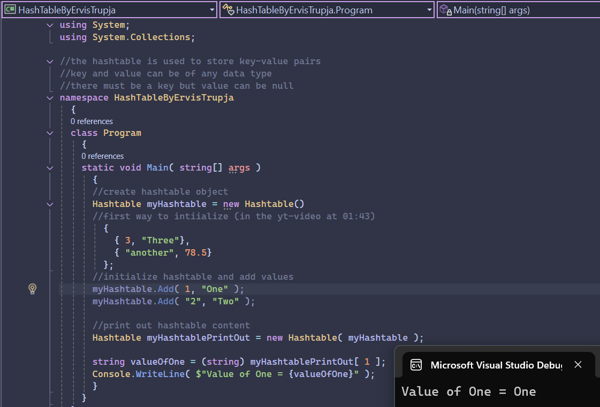

# Hashtable Initialization in C# – Example Project

This project shows different ways to initialize and populate a `Hashtable` in C#. It demonstrates using mixed key and value types, adding entries manually, and copying one hashtable into another.

## 📸 Screenshot

